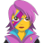

<h1 align="center">Sometimes You Win - Sometimes You Learn🧑‍💻</h1>

### :man_technologist: About me:

👋 𝙷𝚎𝚕𝚕𝚘! My name is Vladislav. I'm a Junior Front-end Developer . Currently, I am studying at GoIT. During my studies, I am gaining deep knowledge of HTML, CSS and JavaScript, as well as exploring popular frameworks and tools such as React, Sass and Git. My main goal is to become a skilled front-end developer and create beautiful, interactive, and user-friendly web applications. I strive not only to enhance my programming skills but also to develop my creativity and problem-solving abilities.

- :mailbox: How to contact me:  

 

### 🤝 Social media:

### 💻 🛠 Technologies and tools:

  &nbsp;
  &nbsp;
  &nbsp;
  &nbsp;
  &nbsp;
  &nbsp;
  &nbsp;
  &nbsp;
  &nbsp;
  &nbsp;
  &nbsp;
  &nbsp;
  &nbsp;
  &nbsp;
  &nbsp;
  &nbsp;
  &nbsp;
  &nbsp;
  &nbsp;
  &nbsp;
  &nbsp;
  &nbsp;
  &nbsp;
  &nbsp;

<!-- ### 💻 Passed courses:

| Курсы                                                           | Дата              |
| ----------------------------------------------------------------| :---------------: |
| GoIT/Старт в программировании                                   | 11/2022 - /       |

<!----------------------------------------- Statistics--------------------------------------------->

<h2 style="color: #44AEFB">📊 Statistics</h2>

<!-- Begin Stats Cards -->

<!-- compact programming languages layout -->

<!--  End Stats Cards -->
